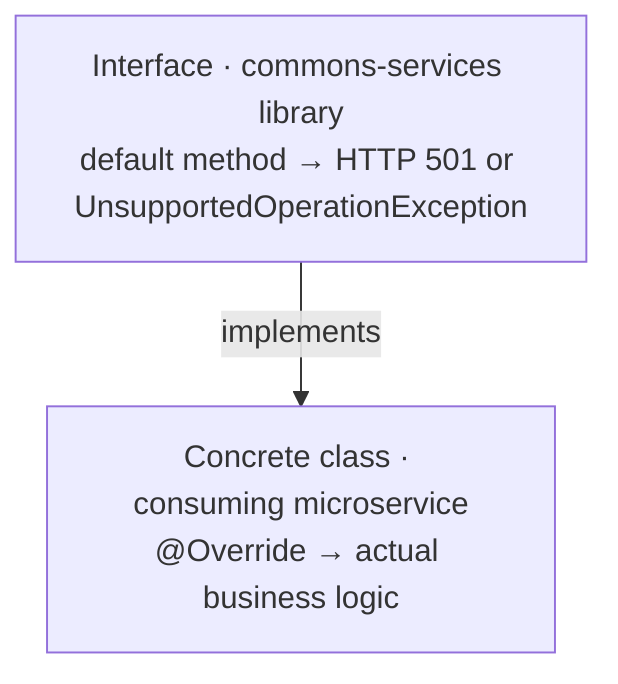
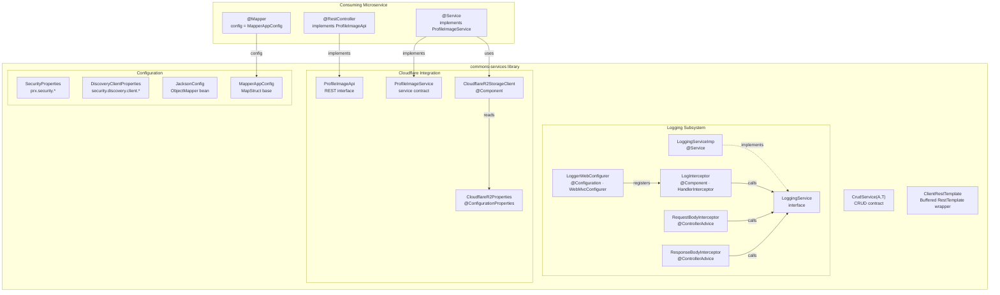
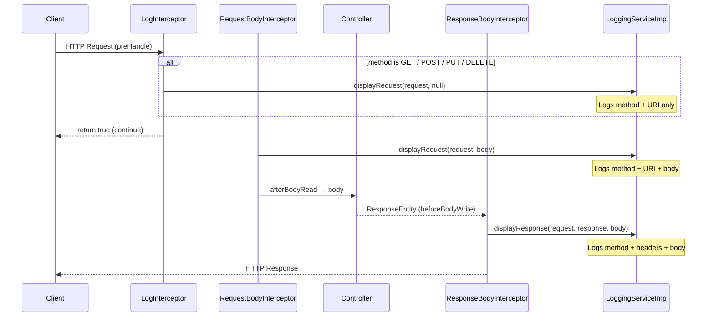
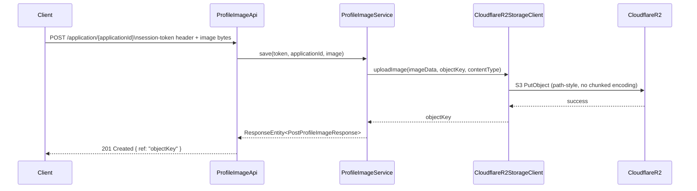

# Architecture Overview

## Purpose

`commons-services` is a **shared Java library** (`com.prx:commons-services:0.0.1`) that provides reusable service components, REST API contracts, interceptors, configuration helpers, and cloud storage integration for PRX microservices. It is **not a runnable application** — it is consumed as a Maven dependency by downstream services.

---

## Technology Stack

| Layer | Technology | Version |
|---|---|---|
| Language | Java | 21 |
| Framework | Spring Boot | 3.5.8 |
| Cloud | Spring Cloud | 2025.0.1 |
| Object Mapping | MapStruct | 1.6.3 |
| Cloud Storage | AWS SDK v2 (S3-compatible) | 2.21.0 |
| API Documentation | SpringDoc OpenAPI | 1.8.0 |
| Logging | Log4j2 | 2.25.3 |
| JSON | Jackson + Gson | managed |
| Testing | JUnit Jupiter + Mockito | 5.14.1 / 5.21.0 |
| Coverage | JaCoCo | 0.8.14 |
| Static Analysis | PMD | 3.28.0 |

---

## Module Structure

```
com.prx.commons.services
├── CrudService<A,T>                      # Generic CRUD contract
├── config/
│   └── mapper/
│       ├── JacksonConfig                 # ObjectMapper with JavaTimeModule
│       └── MapperAppConfig               # Base MapStruct configuration
├── loggers/
│   ├── LoggingService                    # HTTP logging contract
│   ├── LoggingServiceImp                 # Trace-enabled implementation
│   ├── config/
│   │   └── LoggerWebConfigurer           # Registers interceptors via WebMvcConfigurer
│   └── interceptor/
│       ├── LogInterceptor                # HandlerInterceptor (pre-handle)
│       ├── RequestBodyInterceptor        # RequestBodyAdviceAdapter (post-read)
│       └── ResponseBodyInterceptor       # ResponseBodyAdvice (pre-write)
├── properties/
│   ├── DiscoveryClientProperties         # Eureka client SSL config
│   └── SecurityProperties               # Keystore, truststore, management auth
├── rest/
│   └── ClientRestTemplate               # Buffered RestTemplate wrapper
├── util/
│   └── PrinterUtil                      # Conditional logging utility
└── cloudflare/
    ├── controller/
    │   └── ProfileImageApi              # REST interface (Spring MVC)
    ├── properties/
    │   ├── CloudflareR2Properties       # R2 storage config
    │   ├── ManagementAuthenticatorProperties
    │   └── StoreProperties
    ├── r2/client/
    │   └── CloudflareR2StorageClient    # AWS SDK S3 client for R2
    ├── service/
    │   └── ProfileImageService          # Profile image service contract
    └── to/
        ├── PostProfileImageResponse     # Upload response record
        └── GetProfileImageReferenceResponse # Reference response record
```

---

## Core Design Pattern

The library uses an **interface-with-default-methods** pattern throughout. Every contract exposes default method implementations that return HTTP 501 Not Implemented (or throw `UnsupportedOperationException`) — acting as safe stubs. Consuming microservices implement the interface and override only the operations they support.



Interfaces following this pattern:
- `CrudService<A, T>`
- `ProfileImageService`
- `ProfileImageApi`
- `LoggingService`

---

## Component Interaction Diagram



---

## HTTP Request Lifecycle (Logging)



---

## Profile Image Upload Flow



---

## Deployment Model

This library is not deployed independently. It is resolved as a Maven dependency from the Repsy private repository:

```xml
<dependency>
    <groupId>com.prx</groupId>
    <artifactId>commons-services</artifactId>
    <version>0.0.1</version>
</dependency>
```

Repository configuration required in consuming service `pom.xml`:

```xml
<repository>
    <id>repsy</id>
    <name>PRX Private Maven Repository</name>
    <url>https://repo.repsy.io/mvn/lmata/prx</url>
</repository>
```

Publishing requires `REPSY_ACCOUNT_USER` and `REPSY_ACCOUNT_PASSWORD` environment variables.

---

## CI/CD

| Workflow | Trigger | Purpose |
|---|---|---|
| `ci.yml` | Push / PR → main, master | Build + test (`mvn clean verify`) + upload JaCoCo artifact |
| `build.yml` | Push / PR → main, develop | SonarCloud analysis via `sonar-maven-plugin` |
| `qodana_code_quality.yml` | Push / PR / manual | JetBrains Qodana static analysis + SARIF upload |
