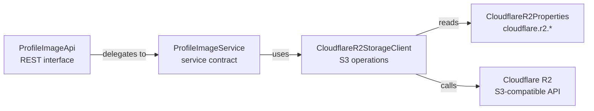

# Cloudflare R2 Integration

This document describes how the `commons-services` library integrates with Cloudflare R2 object storage for profile image management.

---

## Overview

Cloudflare R2 is an S3-compatible object storage service. This library uses the **AWS SDK for Java v2** (`software.amazon.awssdk:s3:2.21.0`) to communicate with R2, leveraging the S3 API compatibility layer.

The integration provides:
- A low-level storage client (`CloudflareR2StorageClient`) for upload, download, and URL generation
- A service interface (`ProfileImageService`) for profile image business operations
- A REST API interface (`ProfileImageApi`) with OpenAPI annotations ready to expose via `@RestController`
- Transfer objects (`PostProfileImageResponse`, `GetProfileImageReferenceResponse`) for API responses

---

## Component Map



---

## CloudflareR2StorageClient

**Class:** `com.umdc.commons.services.cloudflare.r2.client.CloudflareR2StorageClient`  
**Spring bean:** `@Component`

### Initialization

The `S3Client` is **lazily initialized** — it is created on the first call to `getS3Client()` and reused for all subsequent operations.

### Critical S3 Client Configuration

```java
S3Configuration serviceConfiguration = S3Configuration.builder()
    .pathStyleAccessEnabled(true)      // Required: R2 uses path-style URLs
    .chunkedEncodingEnabled(false)     // Required: chunked encoding causes HTTP 403 on R2
    .build();

S3Client.builder()
    .endpointOverride(URI.create(properties.getEndpoint()))
    .credentialsProvider(StaticCredentialsProvider.create(credentials))
    .region(Region.of("auto"))         // Required by SDK; R2 ignores it
    .serviceConfiguration(serviceConfiguration)
    .build();
```

| Setting | Value | Why |
|---|---|---|
| `pathStyleAccessEnabled` | `true` | R2 does not support virtual-hosted-style URLs |
| `chunkedEncodingEnabled` | `false` | Chunked encoding is not supported by R2 and returns HTTP 403 |
| `region` | `"auto"` | AWS SDK v2 requires a region; R2 ignores the value |

---

### Operations

#### Upload Image

```java
public String uploadImage(byte[] imageData, String objectKey, String contentType)
```

- Executes `S3Client.putObject` with the bucket from `CloudflareR2Properties.bucketName`
- Returns the `objectKey` on success
- The caller is responsible for generating a meaningful `objectKey` (e.g., `profiles/{userId}/{filename}`)

#### Download Image

```java
public byte[] downloadImage(String objectKey) throws IOException
```

- Executes `S3Client.getObject` and reads all bytes
- Throws `IOException` on read failure

#### Get Public URL

```java
public String getPublicUrl(String objectKey)
```

- If `cloudflare.r2.publicUrl` is set: returns `publicUrl + "/" + objectKey`
- If not set: returns the `objectKey` as-is

#### Close

```java
public void close()
```

- Closes the underlying `S3Client` if it has been initialized
- Should be called when the application shuts down (consider `@PreDestroy` in the consuming service)

---

## ProfileImageService

**Interface:** `com.umdc.commons.services.cloudflare.service.ImageService`

Both methods use the **default-method stub pattern** — they throw `UnsupportedOperationException` and must be overridden in the consuming service.

### Implementing ProfileImageService

```java
@Service
public class ProfileImageServiceImpl implements ProfileImageService {

    private final CloudflareR2StorageClient r2Client;

    public ProfileImageServiceImpl(CloudflareR2StorageClient r2Client) {
        this.r2Client = r2Client;
    }

    @Override
    public ResponseEntity<PostProfileImageResponse> save(
            String token, UUID applicationId, byte[] image) throws Exception {
        // 1. Validate token & resolve userId
        // 2. Determine object key
        String objectKey = "profiles/" + applicationId + "/" + UUID.randomUUID() + ".jpg";
        // 3. Upload to R2
        r2Client.uploadImage(image, objectKey, "image/jpeg");
        // 4. Return reference
        return ResponseEntity.status(HttpStatus.CREATED)
                .body(new PostProfileImageResponse(objectKey));
    }

    @Override
    public ResponseEntity<GetProfileImageReferenceResponse> getProfileImageReference(
            String token, UUID applicationId) throws Exception {
        // 1. Validate token & resolve userId
        // 2. Lookup stored objectKey for applicationId
        String objectKey = "profiles/" + applicationId + "/latest.jpg";
        String publicUrl = r2Client.getPublicUrl(objectKey);
        return ResponseEntity.ok(new GetProfileImageReferenceResponse(publicUrl));
    }
}
```

---

## ProfileImageApi

**Interface:** `com.umdc.commons.services.cloudflare.controller.ImageApi`

REST interface to be implemented by a `@RestController` in the consuming service. All methods include OpenAPI annotations (`@Operation`, `@ApiResponses`, `@Parameter`).

| Endpoint | Method | Path | Description |
|---|---|---|---|
| Upload | POST | `/application/{applicationId}` | Upload profile image (multipart/form-data) |
| Get Image | GET | `/` | Download raw image bytes |
| Get Reference | GET | `/application/{applicationId}/reference` | Get public URL or storage reference |

See [api-reference.md](api-reference.md) for full endpoint documentation.

### Implementing ProfileImageApi

```java
@RestController
@RequestMapping("/v1/profile-images")
public class ProfileImageController implements ProfileImageApi {

    private final ProfileImageServiceImpl service;

    public ProfileImageController(ProfileImageServiceImpl service) {
        this.service = service;
    }

    @Override
    public ProfileImageService getService() {
        return service;
    }

    @Override
    public ResponseEntity<PostProfileImageResponse> uploadProfileImage(
            String token, UUID applicationId, byte[] image) throws Exception {
        return service.save(token, applicationId, image);
    }

    @Override
    public ResponseEntity<GetProfileImageReferenceResponse> getProfileImageReference(
            String token, UUID applicationId) throws Exception {
        return service.getProfileImageReference(token, applicationId);
    }
}
```

---

## Configuration

See [configuration.md](configuration.md) for all `cloudflare.r2.*` properties.

Minimum required configuration:

```yaml
cloudflare:
  r2:
    accountId: ${CLOUDFLARE_ACCOUNT_ID}
    endpoint: https://${CLOUDFLARE_ACCOUNT_ID}.r2.cloudflarestorage.com
    accessKey: ${CLOUDFLARE_R2_ACCESS_KEY}
    secretKey: ${CLOUDFLARE_R2_SECRET_KEY}
    bucketName: profile-images
    publicUrl: https://pub-example.r2.dev   # optional
```

---

## Object Key Convention (Recommended)

The library does not enforce any object key structure. The recommended convention is:

```
profiles/{applicationId}/{userId}/{uuid}.{ext}
```

Example:
```
profiles/550e8400-e29b-41d4-a716-446655440000/user123/7f3b9c1a-d2e4.jpg
```

---

## Error Handling Considerations

| Scenario | Behavior |
|---|---|
| R2 connection failure | `S3Exception` thrown from `uploadImage`/`downloadImage` — handle in service implementation |
| Invalid credentials | `S3Exception` with HTTP 403 — verify `accessKey` and `secretKey` |
| HTTP 403 with valid credentials | Verify `chunkedEncodingEnabled(false)` is set |
| Bucket not found | `S3Exception` with NoSuchBucket — verify `bucketName` |
| `getPublicUrl` with no `publicUrl` config | Returns raw `objectKey` (not a full URL) |

---

## Security Notes

- `accessKey` and `secretKey` are logged at INFO level during `buildS3Client()`. Consider removing or reducing the log level in production to avoid leaking credentials to log aggregation systems.
- All credentials should be supplied via environment variables — never committed to source control.
- R2 bucket access policies should restrict public read to only the objects that need to be publicly accessible.
