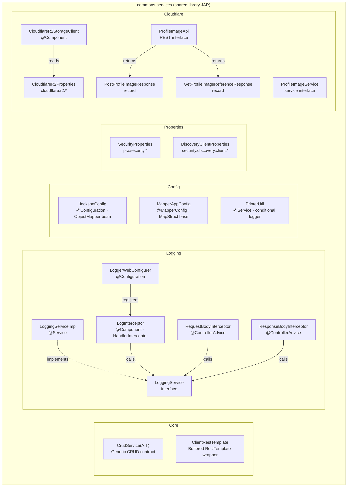
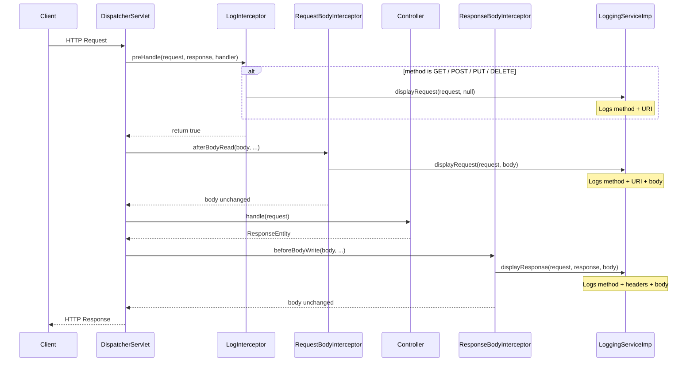
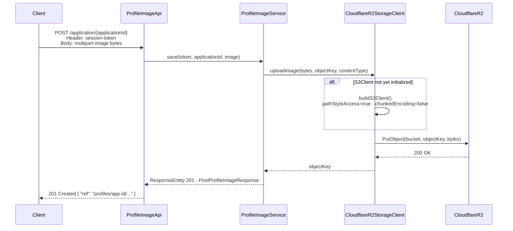
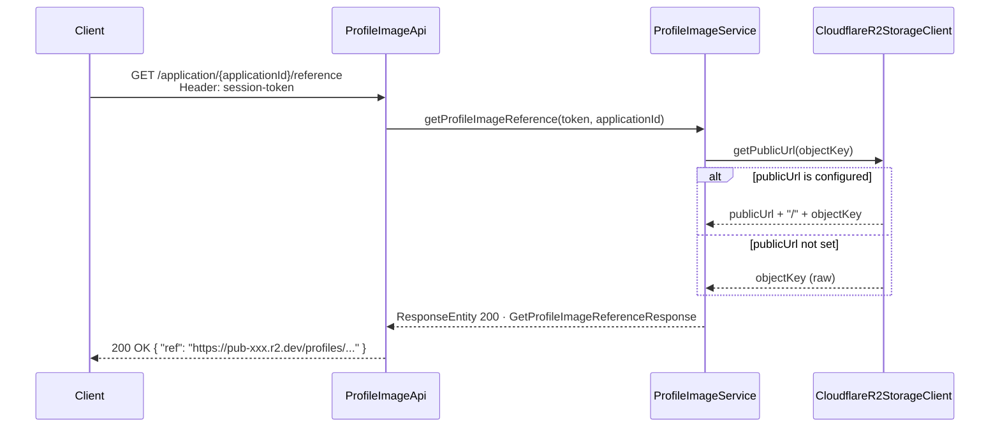
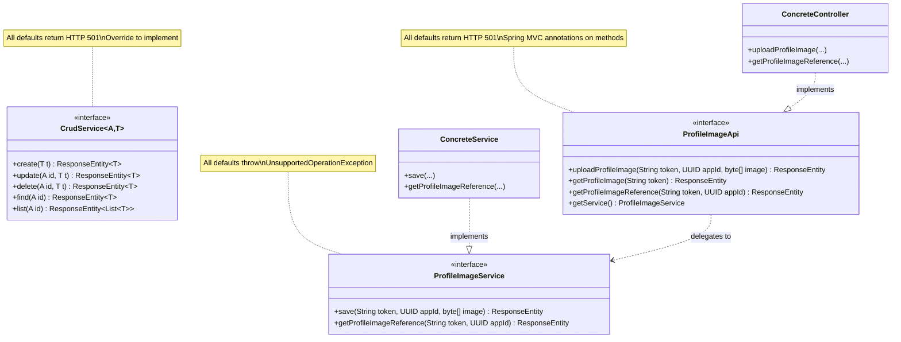
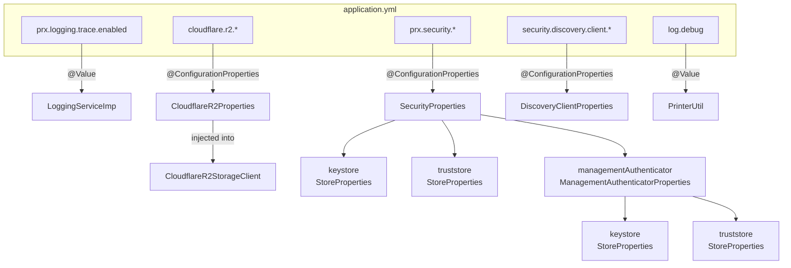
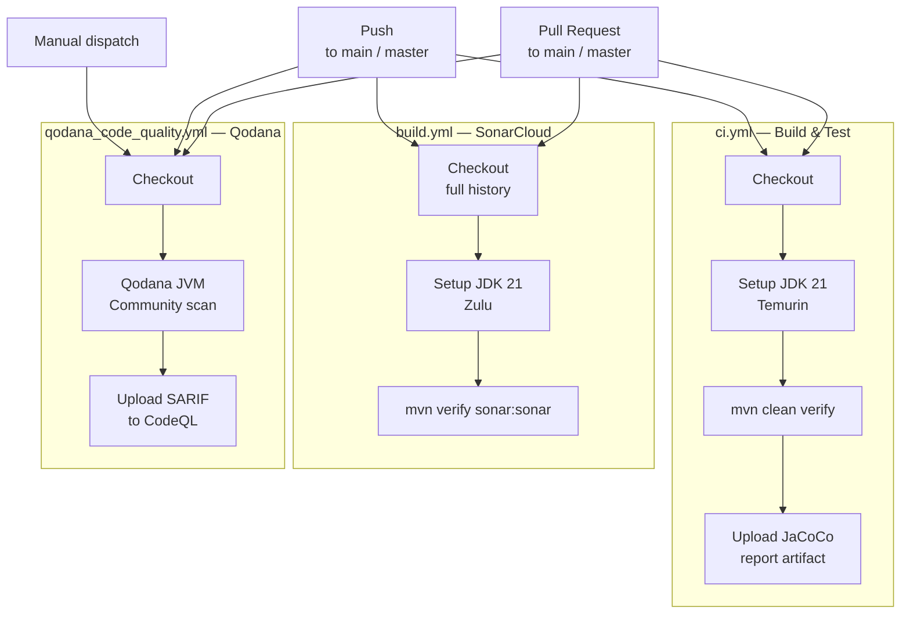
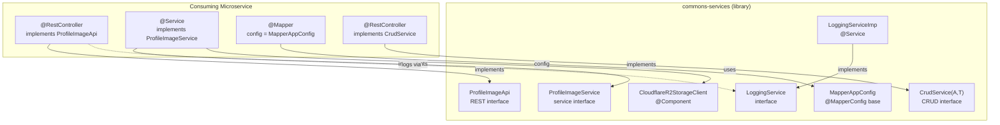

# Architecture Diagrams

All diagrams use [Mermaid](https://mermaid.js.org/) syntax and render natively in GitHub, GitLab, and most modern documentation platforms.

---

## 1. Library Module Overview

---

## 2. Spring MVC Request Pipeline

---

## 3. Cloudflare R2 — Upload Flow

---

## 4. Cloudflare R2 — Retrieve Reference Flow

---

## 5. Interface-with-Default-Methods Pattern

---

## 6. Configuration Properties Map

---

## 7. CI/CD Pipeline

---

## 8. Component Interaction — Library vs Consuming Service

