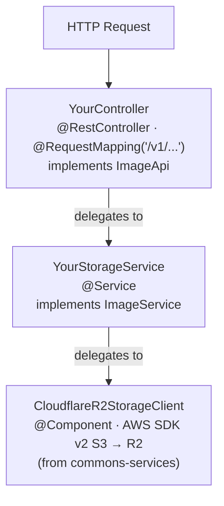
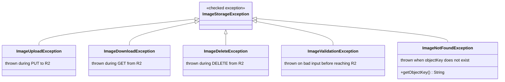

# Image API Implementation Guide

> How to implement `ImageApi` and `ImageService` in a consuming microservice to manage image upload and retrieval via Cloudflare R2.

---

## Overview

`commons-services` ships two default-method interfaces that together form the image storage contract:

| Interface | Package | Role |
|---|---|---|
| `ImageApi` | `com.umdc.commons.services.cloudflare.controller` | Spring MVC REST contract — maps HTTP verbs to storage operations |
| `ImageService` | `com.umdc.commons.services.cloudflare.service` | Business-logic contract — called by `ImageApi` default methods |

Both interfaces follow the **default-method stub** pattern: every operation returns HTTP 501 (or throws `UnsupportedOperationException`) until you override it. You implement only the operations your service needs.

The actual storage is handled by `CloudflareR2StorageClient`, which wraps the AWS SDK v2 S3 client pointed at a Cloudflare R2 endpoint.

---

## Prerequisites

### Maven dependency

Add `commons-services` to your `pom.xml`:

```xml
<dependency>
    <groupId>com.prx</groupId>
    <artifactId>commons-services</artifactId>
    <version>${commons-services.version}</version>
</dependency>
```

### Configuration properties

`CloudflareR2StorageClient` is a `@Component` that reads from a `CloudflareR2Properties` bean (`@ConfigurationProperties(prefix = "cloudflare.r2")`). Add the following to your `application.yml`:

```yaml
cloudflare:
  r2:
    account-id: <your-cloudflare-account-id>
    endpoint: https://<account-id>.r2.cloudflarestorage.com
    access-key: <r2-access-key-id>
    secret-key: <r2-secret-access-key>
    bucket-name: <bucket-name>
    public-url: https://<custom-domain-or-r2-dev-url>   # optional — omit if no public CDN
```

> **Security note:** Never commit credentials to source control. Use environment variables or a secrets manager and reference them via `${ENV_VAR}` substitution.

---

## Architecture



---

## Step 1 — Implement `ImageService`

Create a `@Service` class that implements `ImageService`. Inject `CloudflareR2StorageClient` (it is automatically registered as a Spring bean when `commons-services` is on the classpath).

```java
package com.example.avatars.service;

import com.umdc.commons.services.cloudflare.r2.client.CloudflareR2StorageClient;
import com.umdc.commons.services.cloudflare.service.ImageService;
import com.umdc.commons.services.cloudflare.to.ImageReferenceResponse;
import com.umdc.commons.services.cloudflare.to.ImageUploadRequest;
import com.umdc.commons.services.cloudflare.to.ImageUploadResponse;
import org.springframework.http.HttpStatus;
import org.springframework.http.ResponseEntity;
import org.springframework.stereotype.Service;

import java.util.UUID;

@Service
public class AvatarStorageService implements ImageService {

    private final CloudflareR2StorageClient r2;

    public AvatarStorageService(CloudflareR2StorageClient r2) {
        this.r2 = r2;
    }

    // -------------------------------------------------------------------------
    // Upload
    // -------------------------------------------------------------------------

    @Override
    public ResponseEntity<ImageUploadResponse> upload(ImageUploadRequest request) {
        String key = resolveKey(request);
        r2.uploadImage(request.data(), key, request.contentType());
        String url = r2.getPublicUrl(key);
        return ResponseEntity.status(HttpStatus.CREATED)
                .body(new ImageUploadResponse(key, url, request.contentType(), request.data().length));
    }

    // -------------------------------------------------------------------------
    // Get reference (public URL without downloading bytes)
    // -------------------------------------------------------------------------

    @Override
    public ResponseEntity<ImageReferenceResponse> getReference(String objectKey) {
        String url = r2.getPublicUrl(objectKey);
        return ResponseEntity.ok(new ImageReferenceResponse(objectKey, url, null));
    }

    // -------------------------------------------------------------------------
    // Helpers
    // -------------------------------------------------------------------------

    private String resolveKey(ImageUploadRequest request) {
        if (request.objectKey() != null) {
            return request.objectKey();
        }
        // Convention: context/entity/uuid.ext
        String ext = extensionFor(request.contentType());
        return "avatars/" + UUID.randomUUID() + "." + ext;
    }

    private String extensionFor(String contentType) {
        return switch (contentType) {
            case "image/png"  -> "png";
            case "image/webp" -> "webp";
            case "image/gif"  -> "gif";
            default           -> "jpg";
        };
    }
}
```

### Object-key convention

When `ImageUploadRequest.objectKey()` is `null`, your implementation must generate a unique key. The recommended pattern is:

```
{context}/{entityId}/{uuid}.{ext}

# Examples
avatars/user-123/7f3b4e2a-....jpg
documents/org-456/reports/c9d1-....pdf
```

---

## Step 2 — Implement `ImageApi`

Create a `@RestController` that implements `ImageApi`. Override `getService()` to return your `ImageService` implementation, then override only the endpoints you need.

```java
package com.example.avatars.controller;

import com.umdc.commons.services.cloudflare.controller.ImageApi;
import com.umdc.commons.services.cloudflare.service.ImageService;
import com.umdc.commons.services.cloudflare.to.ImageReferenceResponse;
import com.umdc.commons.services.cloudflare.to.ImageUploadRequest;
import com.umdc.commons.services.cloudflare.to.ImageUploadResponse;
import com.example.avatars.service.AvatarStorageService;
import org.springframework.http.ResponseEntity;
import org.springframework.web.bind.annotation.RequestMapping;
import org.springframework.web.bind.annotation.RestController;

@RestController
@RequestMapping("/v1/avatars")
public class AvatarController implements ImageApi {

    private final AvatarStorageService service;

    public AvatarController(AvatarStorageService service) {
        this.service = service;
    }

    // Wire the service so all default methods delegate correctly
    @Override
    public ImageService getService() {
        return service;
    }

    // -------------------------------------------------------------------------
    // Upload — POST /v1/avatars/upload
    // -------------------------------------------------------------------------
    @Override
    public ResponseEntity<ImageUploadResponse> upload(
            String token, String objectKey, byte[] image, String contentType) {
        return service.upload(ImageUploadRequest.of(objectKey, image, contentType));
    }

    // -------------------------------------------------------------------------
    // Get reference — GET /v1/avatars/reference?objectKey=...
    // -------------------------------------------------------------------------
    @Override
    public ResponseEntity<ImageReferenceResponse> getReference(String token, String objectKey) {
        return service.getReference(objectKey);
    }
}
```

> Endpoints you do **not** override return HTTP `501 Not Implemented` automatically — no extra code needed.

---

## API Reference

All endpoints inherit the mapping from your `@RequestMapping` base path and the sub-path from `ImageApi`.

### Authentication

Every endpoint requires a `session-token` request header:

```
session-token: <caller-session-token>
```

### Endpoints

#### `POST /upload`

Uploads an image. Consumes `multipart/form-data`, produces `application/json`.

| Part | Type | Required | Description |
|---|---|---|---|
| `image` | `byte[]` | Yes | Raw image bytes |
| `contentType` | `String` | No | MIME type (defaults to `image/jpeg`) |
| `objectKey` | `String` | No | Storage key; auto-generated when omitted |

**Response `201 Created`:**

```json
{
  "objectKey": "avatars/user-123/7f3b4e2a.jpg",
  "publicUrl": "https://cdn.example.com/avatars/user-123/7f3b4e2a.jpg",
  "contentType": "image/jpeg",
  "size": 204800
}
```

---

#### `GET /reference?objectKey=...`

Returns the public URL and metadata for a stored image without downloading the bytes.

**Response `200 OK`:**

```json
{
  "objectKey": "avatars/user-123/7f3b4e2a.jpg",
  "publicUrl": "https://cdn.example.com/avatars/user-123/7f3b4e2a.jpg",
  "contentType": "image/jpeg"
}
```

---

#### `GET /download?objectKey=...`

Returns the raw image bytes.

**Response `200 OK`:** `application/octet-stream` (or the original content type)

---

#### `DELETE /delete?objectKey=...`

Permanently removes the image.

**Response `204 No Content`**

---

#### `GET /exists?objectKey=...`

Checks whether an image exists at the given key.

**Response `200 OK`:**

```json
true
```

---

#### `GET /list?prefix=...`

Lists all images whose key starts with the given prefix. Omit `prefix` to list everything.

**Response `200 OK`:**

```json
[
  {
    "objectKey": "avatars/user-123/7f3b4e2a.jpg",
    "publicUrl": "https://cdn.example.com/avatars/user-123/7f3b4e2a.jpg",
    "contentType": null
  }
]
```

---

## Data Transfer Objects

### `ImageUploadRequest`

Immutable record carrying the data for an upload. Use the static factory methods — the constructor validates inputs.

```java
// Auto-generated key
ImageUploadRequest.of(bytes, "image/jpeg");

// Explicit key
ImageUploadRequest.of("avatars/user-123/photo.jpg", bytes, "image/jpeg");

// With metadata
ImageUploadRequest.of("avatars/user-123/photo.jpg", bytes, "image/jpeg",
    Map.of("userId", "user-123", "source", "mobile-app"));
```

| Field | Type | Nullable | Description |
|---|---|---|---|
| `objectKey` | `String` | Yes | Storage path; implementation generates one when null |
| `data` | `byte[]` | No | Raw image bytes; must be non-empty |
| `contentType` | `String` | No | MIME type (e.g. `image/jpeg`) |
| `metadata` | `Map<String,String>` | Yes | Custom metadata stored alongside the object |

### `ImageUploadResponse`

```java
record ImageUploadResponse(String objectKey, String publicUrl, String contentType, long size)
```

### `ImageReferenceResponse`

```java
record ImageReferenceResponse(String objectKey, String publicUrl, String contentType)
```

> `contentType` may be `null` in list results if the content type was not stored as object metadata.

---

## Exception Handling

All exceptions extend `ImageStorageException` (checked). Map them to HTTP responses in a `@ControllerAdvice`:

```java
@ControllerAdvice
public class ImageExceptionHandler {

    @ExceptionHandler(ImageNotFoundException.class)
    public ResponseEntity<String> handleNotFound(ImageNotFoundException ex) {
        return ResponseEntity.status(HttpStatus.NOT_FOUND)
                .body("Image not found: " + ex.getObjectKey());
    }

    @ExceptionHandler(ImageValidationException.class)
    public ResponseEntity<String> handleValidation(ImageValidationException ex) {
        return ResponseEntity.badRequest().body(ex.getMessage());
    }

    @ExceptionHandler(ImageUploadException.class)
    public ResponseEntity<String> handleUpload(ImageUploadException ex) {
        return ResponseEntity.status(HttpStatus.INTERNAL_SERVER_ERROR).body(ex.getMessage());
    }

    @ExceptionHandler(ImageStorageException.class)
    public ResponseEntity<String> handleStorage(ImageStorageException ex) {
        return ResponseEntity.status(HttpStatus.INTERNAL_SERVER_ERROR).body(ex.getMessage());
    }
}
```

### Exception hierarchy



---

## Minimal end-to-end example

The following shows the complete flow: controller → service → R2 client.

```
POST /v1/avatars/upload
  session-token: abc123
  Content-Type: multipart/form-data

  image=<bytes>
  contentType=image/png

→ AvatarController.upload("abc123", null, <bytes>, "image/png")
→ AvatarStorageService.upload(ImageUploadRequest.of(<bytes>, "image/png"))
→ resolveKey() → "avatars/550e8400-e29b-41d4-a716-446655440000.png"
→ r2.uploadImage(<bytes>, "avatars/550e...png", "image/png")
→ r2.getPublicUrl("avatars/550e...png")
    → "https://cdn.example.com/avatars/550e...png"

← 201 Created
   {
     "objectKey": "avatars/550e8400-e29b-41d4-a716-446655440000.png",
     "publicUrl": "https://cdn.example.com/avatars/550e8400-e29b-41d4-a716-446655440000.png",
     "contentType": "image/png",
     "size": 94208
   }
```

```
GET /v1/avatars/reference?objectKey=avatars/550e8400-e29b-41d4-a716-446655440000.png
  session-token: abc123

→ AvatarController.getReference("abc123", "avatars/550e...png")
→ AvatarStorageService.getReference("avatars/550e...png")
→ r2.getPublicUrl("avatars/550e...png")

← 200 OK
   {
     "objectKey": "avatars/550e8400-e29b-41d4-a716-446655440000.png",
     "publicUrl": "https://cdn.example.com/avatars/550e8400-e29b-41d4-a716-446655440000.png",
     "contentType": null
   }
```

---

## Related documentation

- [Cloudflare R2 Integration](cloudflare-r2-integration.md) — low-level `CloudflareR2StorageClient` configuration and R2-specific quirks
- [Configuration Reference](configuration.md) — all `cloudflare.r2.*` properties
- [Architecture Overview](architecture.md) — how this library fits into the broader PRX platform
