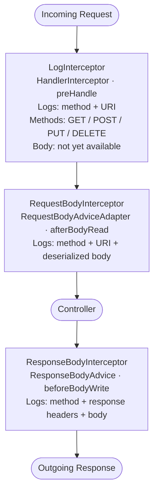
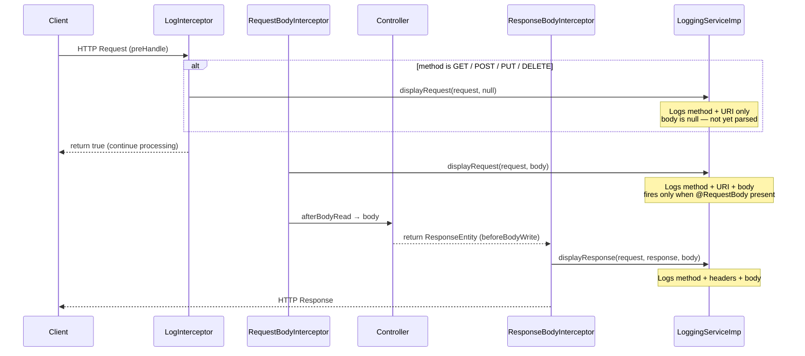

# HTTP Logging Subsystem

The logging subsystem provides transparent HTTP request and response tracing across all endpoints in a consuming Spring MVC application. It is controlled by a single configuration flag and requires no code changes in controllers.

---

## Overview

Three cooperating components intercept the Spring MVC processing pipeline at different stages:



---

## Enabling Trace Logging

Set the following in the consuming service's configuration:

```yaml
prx:
  logging:
    trace:
      enabled: ${LOGGING_TRACE_ENABLED:false}
```

When `false` (the default), all three interceptors are active in the Spring pipeline but `LoggingServiceImp` skips all logging — **zero performance overhead** from log formatting.

---

## Log Output Format

All messages are logged at `INFO` level via SLF4J.

**Request (from `LogInterceptor` and `RequestBodyInterceptor`):**
```
log request: REQUEST method = [POST] path = [/api/v1/users] parameters = [{name=John}] body = [{"email":"john@example.com"}]
```

**Response (from `ResponseBodyInterceptor`):**
```
logResponse: RESPONSE method = [POST] ResponseHeaders = [{Content-Type=application/json}] responseBody = [{"id":1,"name":"John"}]
```

---

## Component Details

### LoggingService Interface

```java
public interface LoggingService {
    void displayRequest(HttpServletRequest request, Object body);
    void displayResponse(HttpServletRequest request, HttpServletResponse response, Object body);
}
```

The consuming service can replace `LoggingServiceImp` with a custom implementation by providing an alternative `@Service` bean of type `LoggingService`.

---

### LoggingServiceImp

**Bean:** `@Service`  
**Reads:** `prx.logging.trace.enabled`

Behavior when `isTraceEnabled = true`:

**`displayRequest`** builds a message containing:
1. HTTP method and request URI
2. Query parameters map (if not empty)
3. Request body object (if not null)

**`displayResponse`** builds a message containing:
1. HTTP method
2. Response header map (if not empty)
3. Response body object

---

### LogInterceptor

**Bean:** `@Component`  
**Type:** `HandlerInterceptor`  
**Registered by:** `LoggerWebConfigurer` → `InterceptorRegistry`

Fires in `preHandle`. Covers only **GET, POST, PUT, DELETE** (exact case-sensitive match against `HttpMethod` constants). At this point the body has not been read, so `null` is passed to `displayRequest`. Always returns `true` — never blocks the request.

---

### RequestBodyInterceptor

**Bean:** `@ControllerAdvice`  
**Type:** `RequestBodyAdviceAdapter`

Fires in `afterBodyRead` after Jackson deserializes the request body. The deserialized body object is passed to `displayRequest`. Supports all method parameters and converter types unconditionally.

> **Note:** This interceptor fires only for requests with a body (i.e., when `@RequestBody` is present). For requests without a body (GET), only `LogInterceptor` fires.

---

### ResponseBodyInterceptor

**Bean:** `@ControllerAdvice`  
**Type:** `ResponseBodyAdvice<Object>`

Fires in `beforeBodyWrite` before Jackson serializes the response. Unwraps `ServerHttpRequest`/`ServerHttpResponse` (reactive wrappers) back to their Servlet equivalents before delegating. Returns the body unchanged.

---

### LoggerWebConfigurer

**Bean:** `@Configuration`  
**Type:** `WebMvcConfigurer`

Registers `LogInterceptor` globally via `InterceptorRegistry.addInterceptor(logInterceptor)`. All request paths are covered — no path pattern filtering.

---

## Sequence Diagram



---

## Replacing the Logging Implementation

To customize log output or integrate with a different logging backend, provide a Spring bean that implements `LoggingService`:

```java
@Service
@Primary  // Override the default LoggingServiceImp
public class CustomLoggingService implements LoggingService {

    @Override
    public void displayRequest(HttpServletRequest request, Object body) {
        // Custom structured logging, e.g., JSON to Datadog
    }

    @Override
    public void displayResponse(HttpServletRequest request, HttpServletResponse response, Object body) {
        // Custom response logging
    }
}
```

---

## Disabling for Specific Endpoints

The logging subsystem does not provide built-in per-endpoint filtering. Options:
1. Set `prx.logging.trace.enabled=false` globally
2. Provide a custom `LoggingService` implementation that inspects `request.getRequestURI()` and skips specific paths
3. Override `LoggerWebConfigurer` and apply path exclusion patterns via `InterceptorRegistry.addInterceptor(...).excludePathPatterns(...)`
